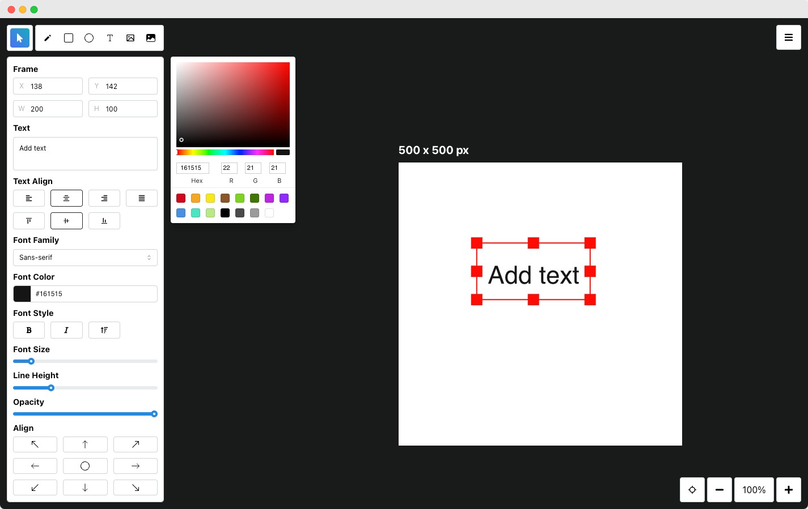

# Typescript Challenge 
## Introduction
We are thrilled that you're interested in joining our team! This role is incredibly important to our company, and we’re looking for someone who not only writes great code but also understands the "when and why" behind it. Your ability to think critically and apply thoughtful solutions is just as important as your technical skills.

##  Challenge: Modernizing a Canvas Drawing Application

## Scenario
You are tasked with evaluating an existing canvas-based drawing application, Flatdraw, which is built using TypeScript, React, and Next.js. The project is functional and well-structured but could benefit from modernization and enhancements to improve its performance, usability, and maintainability.

## Objective
Your goal is to review the Flatdraw repository (https://github.com/diogocapela/flatdraw), analyze its current implementation, and provide recommendations for modernization and improvement. Specifically, focus on areas such as architecture, scalability, UI/UX, and integration of new technologies.

### Flatdraw

### Task 1: Code Analysis and Recommendations

#### Review the repository's code structure, document your findings, and recommend specific improvements. Focus on some of the following characteristics:
- Areas that could benefit from refactoring or improved organization.
- Any technical debt or legacy patterns that could be modernized.
- Opportunities to integrate modern libraries, tools, or frameworks.

#### For example:
- How would you modernize the state management approach?
- Could the rendering performance be enhanced, and if so, how?
- Are there newer libraries or frameworks that you would introduce?

### Task 2: Key Features for Enhancement

#### Identify two key features or areas of the application that you would enhance or rebuild. For each:
- Describe the changes you would make.
- Explain how these changes would improve the application (e.g., better performance, more maintainable code, or improved user experience).

### Task 2A: Focus on Modernization
#### Focus on how these enhancements will impact the tool, and how it will help modernize Flatdraw:
- Adoption of modern React features (e.g., hooks, context API, or server components in Next.js).
- Use of advanced TypeScript features for improved type safety.
- Introduction of testing tools or methods for better code reliability.
- Improvements to CI/CD processes or deployment workflows.

### Task 3: Implementation Plan

#### Draft a high-level implementation plan for the recommended changes. This should include:
- A brief outline of the steps required to implement the changes.
- Tools, libraries, or frameworks you would use.
- Expected benefits and trade-offs.

--- 

Final Deliverable

The final deliverable will be accepted in any form (e.g., a document, presentation, or code snippet). Please choose the format that best conveys your recommendations and solutions.

Time Expectation

This challenge is designed to take approximately 2-3 hours of focused work. Please manage your time accordingly and focus on quality over quantity.

---

##  Problems/Feedback

If you have any feedback or problems throughout these challenges, feel free to reach out to employment@arbitrsecurity.com